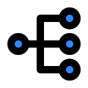

## DrawTheNet.IO : Diagrams as code for engineers.



DrawTheNet.IO draws network diagrams dynamically from a text file describing the placement, layout and icons. 
Given a yaml file describing the hierarchy of the network and it's connections, a resulting diagram will be created. 


# Motivation

Complex network diagrams typically involve specific place of icons, connections and labels using a tool like Visio or OmniGraffle using a mouse and constantly zooming in and out for single pixel placement. 
The goal behind drawthenet.io is to be able to describe the digram in a text file and have it rendered in SVG in the browser. 
I simply wanted to be able to draw network diagrams as fast as it could be done on a dry-erase board without using a mouse.
Also, being able to store a diagram as text makes it easy to version control and share.

# Quick start

Go to https://drawthenet.io and start creating diagrams.

# More Info
You can find a detaile help guide, including a full list of availalble properties integrated into the app by using the ? button in the top left corner of it, [direcly in github](./src/help.html), or [on the website](https://drawthenet.io/help.html)


# Vendors Icons
The follwing vendors are available by default:
 - Amazon Web Services (as AWS), from https://aws.amazon.com/architecture/icons/?nc1=h_ls
 - Microsoft Azure (as Azure), from https://learn.microsoft.com/fr-fr/azure/architecture/icons/
 - Microsoft 365 (as M365), from https://learn.microsoft.com/fr-fr/microsoft-365/solutions/architecture-icons-templates
 - Microsoft Dynamics 365 (as D365), from https://learn.microsoft.com/fr-fr/dynamics365/get-started/icons
 - Microsoft Power Platform (as PowerPlatform), from https://learn.microsoft.com/fr-fr/power-platform/guidance/icons
 - Cisco (as Cisco), from https://www.cisco.com/c/en/us/about/brand-center/network-topology-icons.html
 
You also have access to all the icons from [Iconify](https://icon-sets.iconify.design/)

# Privacy notice

Tha app was designed to be used in a browser and does not require any installation. No diagram are stored anywhere but locally to your PC.

# Build Instruction
## Docker Build (Prefered)

You can easily build the tool to host locally with the provided [docker file](./tools/Dockerfile)

```
cd ./tools/
docker build -t local/drawthenet.io .
```
It will build the docker image from scratch, including downloading the icons from alland you can run it with the following command:


## Local Build
You need [libvisio2svg](https://github.com/kakwa/libvisio2svg) installed and available in you path for the full build to work.
If not, some icons set (Cisco, Fortinet) will not be generated and avaialable.
You can find the build script in the [tools folder](./tools/build.ps1)

```
cd ./tools/
pwsh ./build.ps1
```

Additional arguments can be passed to the script to only run parts of the build process, refer to the script for more information.

## Built with great open source software

- **JQuery** https://jquery.com/
- **Bootstrap** https://getbootstrap.com/
- **D3.js:** https://d3js.org/
- **Ace editor:** https://ace.c9.io/
- **Iconify:** https://iconify.design/
- **Fuse.js:** https://fusejs.io/
- **js-yaml:** https://github.com/nodeca/js-yaml
- **JQuery Toast** https://kamranahmed.info/toast
- **Showdown:** https://github.com/showdownjs/showdown
- **Highlight.js:** https://highlightjs.org/


## Contributing

Please do.

## Versioning

1.0 Initial release.
2.0 Updated frameworks & added new saves and icons features.

## Authors

* **Bradley Thornton** - 2016-2022 *Initial work* - [cidrblock](https://github.com/cidrblock)
* **Rémy Grandin** - 2023-Today *Rework & modernization* - [remygrandin](https://github.com/remygrandin)

## License

This project is licensed under the MIT License. (see LISENCE.TXT)

The logo of the project is licensed under the Apache 2.0 (https://github.com/bytedance/IconPark/blob/master/LICENSE)